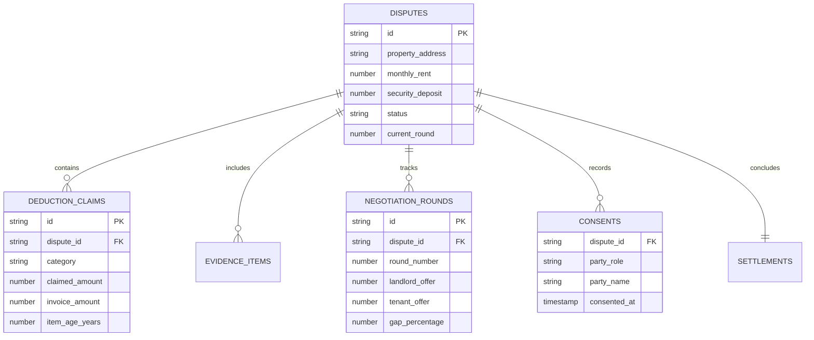

# System Architecture: The Deposit War Room

Welcome! If you are a first-year student or beginner programmer, this document explains exactly how **The Deposit War Room** works under the hood in plain, simple English.

---

## 1. What the Application Does

In cities like Bengaluru, tenants often pay deposits worth 6 to 10 months of rent (e.g., ₹2,00,000). When moving out, landlords often deduct huge sums (like ₹50,000+) for repainting, cleaning, and replacing old appliances. This leads to bitter arguments and legal threats.

**The Deposit War Room** is an **Online Dispute Resolution (ODR)** web application. It acts as an objective, digital referee:
1. It collects evidence from both tenant and landlord.
2. It uses an **explainable Rule Engine** based on Karnataka tenancy rules to suggest fair, lawful deductions.
3. It gives both parties an interactive **Negotiation Room** (capped at 3 rounds).
4. If their offers converge within 5%, it creates a binding **Settlement Agreement PDF** with digital consent.

---

## 2. What Pages Exist

The application is structured into 9 clean screens:

1. **Landing / Home (`/`)**:
   - The front door. Introduces the 5-stage lifecycle (`INTAKE → EVIDENCE → EVALUATE → NEGOTIATION → SETTLEMENT`).
   - Has two main buttons: `[Start as Tenant]` and `[Start as Landlord]`.
   - Has the magic button: `[🚀 RUN 5-MINUTE DEMO]` to instantly load a pre-built dispute.

2. **Dispute Dashboard (`/dispute/[id]`)**:
   - The central command center.
   - Shows the Dispute ID, parties, property address, deposit amounts, and a visual 5-stage progress stepper.
   - Lets you switch between viewing as **Tenant**, **Landlord**, or **Neutral Evaluator**.

3. **Tenant Portal (`/dispute/[id]/tenant`)**:
   - Intake form where the tenant submits tenancy dates, deposit paid, deposit returned, and item-by-item dispute statements.

4. **Landlord Portal (`/dispute/[id]/landlord`)**:
   - Intake form where the landlord submits itemized withholding claims (Painting, Cleaning, Fixtures, Utilities, Rent) along with invoices and item age.

5. **Evidence Evaluation (`/dispute/[id]/evidence`)**:
   - A side-by-side comparison table showing:
     `CLAIM | LANDLORD DEMAND | TENANT STATEMENT | EVIDENCE | STATUTORY / ODR RULE | SYSTEM RECOMMENDATION`.
   - Allows an evaluator to mark items as `Normal Wear and Tear` or override recommendations.

6. **Deduction Calculation (`/dispute/[id]/evaluation`)**:
   - The math transparency screen.
   - For every deduction, users can click **"Why this deduction?"** to see the full breakdown (original claim, depreciation applied, disallowed wear-and-tear, and final allowed deduction).

7. **Negotiation Room (`/dispute/[id]/negotiate`)**:
   - The core judging highlight.
   - Features the **Gap Visualizer**: visual comparative bars showing Landlord Position vs Tenant Position vs System Recommendation.
   - Shows Rounds 1, 2, and 3 counteroffers.
   - Shows the live Gap Percentage.

8. **Settlement & Consent (`/dispute/[id]/settle`)**:
   - Once the gap is $\le 5\%$, this screen unlocks.
   - Both parties review the agreed refund and tick the digital consent box (recording name and IST timestamp).

9. **Settlement PDF (`/dispute/[id]/settle/pdf`)**:
   - A printable, high-fidelity legal settlement agreement formatted with official dispute stamp, claim breakdowns, negotiation audit log, and digital signatures.

---

## 3. What Data is Stored

The database stores 8 simple entities:



1. **`disputes`**: The main record (property address, monthly rent, total deposit, current status, active round).
2. **`parties`**: Tenant and landlord contact details.
3. **`deduction_claims`**: Each item claimed by landlord (Painting, Cleaning, Fixture, Utility, Rent).
4. **`evidence_items`**: Photos, invoices, move-in checklists, and utility bills.
5. **`evaluations`**: The rule engine's calculated breakdown per claim (allowed amount, rejected amount, reason).
6. **`negotiation_rounds`**: Historical log of counteroffers (Round 1 to 3) and gap percentages.
7. **`consents`**: Timestamps and names when tenant and landlord check "I Agree".
8. **`settlements`**: The finalized settlement terms and refund amounts.

---

## 4. How the Rule Engine Works

The rule engine lives in a clean folder: `/lib/rules/`.  
It never hardcodes magic numbers inside React components.

Each category has a dedicated function:

- **`calculatePaintingDeduction(claim, evidence)`**:
  - If tenant stayed $\ge 2$ years and condition is `NORMAL_WEAR_AND_TEAR`: **Allowed = ₹0** (Landlord maintenance responsibility under TPA Section 108(m)).
  - If malicious damage is verified and GST invoice is provided: **Allowed = invoice amount**.
- **`calculateFixtureDeduction(claim, fixtureAge, replacementCost)`**:
  - Applies 10% straight-line annual depreciation:
    $$\text{Depreciation} = \min(\text{Age} \times 10\%, 100\%)$$
    $$\text{Allowed} = \text{Replacement Cost} \times (1 - \text{Depreciation})$$
  - Landlords cannot claim new for old!
- **`calculateUtilityDeduction(claim, billAmount)`**:
  - Matches the bill to actual occupancy dates. Allowed = exact invoiced bill amount.
- **`calculateCleaningDeduction(claim, evidence)`**:
  - Disallows routine cleaning fees; allows deep cleaning only if move-out evidence proves abnormal filth. Capped at ₹5,000.
- **`calculateUnpaidRentDeduction(claim, rentRecords)`**:
  - Allowed 100% if tenant rent ledger has arrears (Karnataka Rent Act Section 27(2)(a)).

Each function returns:
```typescript
{
  category: "FIXTURES",
  claimedAmount: 25000,
  allowedAmount: 15000,
  rejectedAmount: 10000,
  ruleApplied: "ODR_FIXTURE_DEPRECIATION",
  statutoryBasis: "Non-Betterment Tort Principle & Ind AS 16 (Configurable ODR Policy)",
  explanation: "4-year-old fixture depreciated at 10% p.a. (40% total). Allowed 60% residual value."
}
```

---

## 5. How Negotiation Works

1. Landlord and Tenant make counteroffers on the total deduction amount.
2. The system computes the **Gap Percentage**:
   $$\text{Gap \%} = \frac{|\text{Landlord} - \text{Tenant}|}{\max(\text{Landlord}, \text{Tenant})} \times 100$$
3. **Round Limit**: Exactly **3 rounds**.
   - If parties reach Round 3 and the gap is still $> 5\%$, the state changes to `MEDIATOR_REVIEW`. No more counteroffers are accepted!
4. **Settlement Trigger**:
   - If $\text{Gap} \le 5\%$ in any round, the system immediately changes status to `SETTLEMENT_ELIGIBLE`.
   - Both parties are prompted for Digital Consent.

---

## 6. How the PDF is Generated

- The PDF preview is rendered in pure HTML/CSS styled to look like an official stamped legal agreement.
- It uses standard web print stylesheets (`@media print`) and an instant browser/vector PDF download trigger.
- Why this approach? Because complex backend PDF engines (like Puppeteer) frequently crash in serverless environments or take 10+ seconds to boot. A clean client/server print stylesheet generates crystal-clear vector PDFs in 0.1 seconds without any external dependencies!

---

## 7. How Supabase is Used (Dual-Mode Architecture)

To ensure this project is 100% reliable for hackathons and beginner setups:

- **Mode 1 (Local Demo Store)**: Built-in instant in-memory and browser storage. You can run the entire 5-minute demo right out of the box with zero database configuration.
- **Mode 2 (Supabase PostgreSQL)**: When you add your `NEXT_PUBLIC_SUPABASE_URL` and `NEXT_PUBLIC_SUPABASE_ANON_KEY`, the application automatically syncs with your real Supabase cloud database!
- We provide a single SQL file (`/supabase/migrations/20260911_initial_schema.sql`) that you can copy-paste into the Supabase SQL editor in 30 seconds.

---

## 8. How Deployment Will Work

Deploying is as easy as 1-2-3:
1. **GitHub**: We push our code to a new GitHub repository.
2. **Vercel**: We log into [vercel.com](https://vercel.com) with GitHub, click "Import Project", and click "Deploy".
3. **Live URL**: Within 60 seconds, Vercel gives you a public link (e.g. `https://deposit-war-room.vercel.app`) that judges anywhere in the world can open on their laptop or phone.
