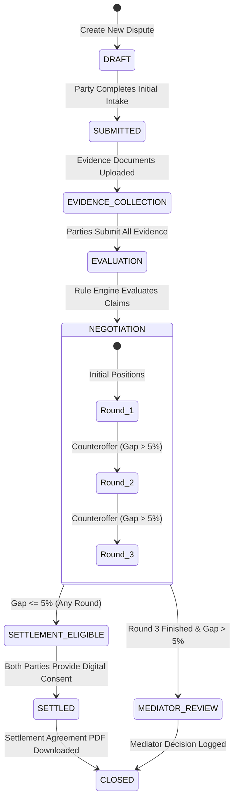

# Dispute Lifecycle State Machine

**Project:** The Deposit War Room  
**Module:** `/lib/state-machine/`

---

## 1. State Diagram



---

## 2. Formal State Definitions

| State Name | Allowed Actions | Next Legal States | Conditions / Guard Rules |
| :--- | :--- | :--- | :--- |
| `DRAFT` | Enter property, rent, and deposit details | `SUBMITTED` | Required address and financial amounts must be valid positive numbers. |
| `SUBMITTED` | Upload initial claims or dispute statement | `EVIDENCE_COLLECTION` | At least one party has submitted their intake form. |
| `EVIDENCE_COLLECTION` | Add photos, invoices, utility bills, condition tags | `EVALUATION` | Minimum evidence threshold reached (or both parties lock evidence). |
| `EVALUATION` | Run rule engine; apply wear & tear and depreciation | `NEGOTIATION` | All 5 claim categories have calculated recommendations. |
| `NEGOTIATION` | Submit counteroffers (Rounds 1, 2, 3) | `SETTLEMENT_ELIGIBLE`<br>`MEDIATOR_REVIEW` | • If $\text{Gap} \le 5\% \rightarrow \text{SETTLEMENT\_ELIGIBLE}$<br>• If $\text{Round} = 3$ & $\text{Gap} > 5\% \rightarrow \text{MEDIATOR\_REVIEW}$<br>• Any Round 4 attempt is strictly blocked. |
| `SETTLEMENT_ELIGIBLE` | Review terms; provide digital consent checkbox | `SETTLED` | Requires **both** `tenant_consented = true` AND `landlord_consented = true`. |
| `MEDIATOR_REVIEW` | Review deadlock; export mediator dossier | `CLOSED` | Triggers human intervention when automated consensus cannot be reached. |
| `SETTLED` | Preview and print Settlement PDF | `CLOSED` | Settlement agreement signed and cryptographically recorded. |
| `CLOSED` | Read-only archive access | None (Terminal) | Immutable record. |

---

## 3. Mathematical State Transition Rules

### 3.1 Gap Calculation
For any negotiation round with Landlord counteroffer $L$ and Tenant counteroffer $T$:

$$\text{gapPercentage} = \frac{|L - T|}{\max(L, T)} \times 100$$

### 3.2 Settlement Eligibility Guard
```typescript
if (gapPercentage <= settlementThreshold) { // Default: 5%
  transitionTo("SETTLEMENT_ELIGIBLE");
} else if (currentRound >= maxRounds) {    // Default: 3
  transitionTo("MEDIATOR_REVIEW");
} else {
  currentRound += 1;
  // Remain in NEGOTIATION for next round
}
```

### 3.3 Strict Invariant Protections
1. **No Skip-Ahead**: You cannot jump from `DRAFT` directly to `SETTLEMENT_ELIGIBLE`.
2. **Hard Round Ceiling**: Round 4 cannot be triggered under any circumstances.
3. **Dual Consent Requirement**: One party agreeing alone does not transition the case to `SETTLED`. The state remains `SETTLEMENT_ELIGIBLE` until both parties have signed.
